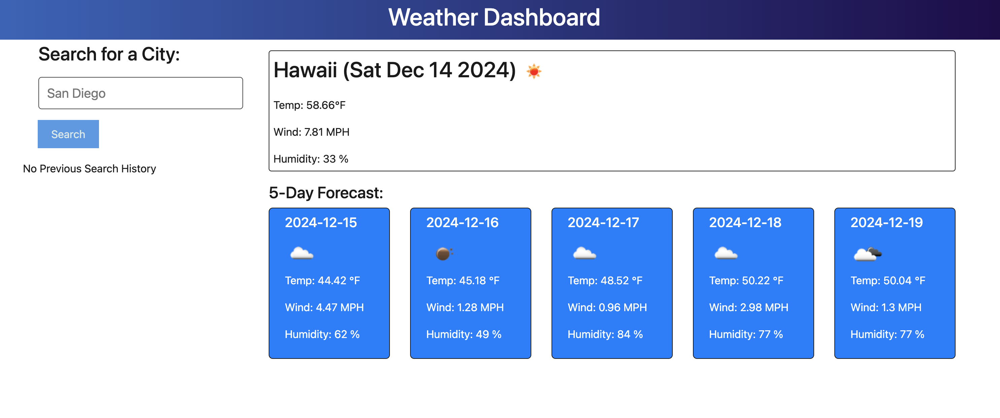

# Weather-Dashboard

 

## Description

This application uses an External API that accesses weather information utilizing [Open Weather Map](https://openweathermap.org/api).  It uses the 5 day weather forecast API based on the city you search.  The application also maintains your search history and allows you to delete cities from your search history.

## Table of Contents

- [License](#license)
- [Questions](#questions)

## License

Licensed under the [MIT](https://opensource.org/licenses/MIT) license.

## Questions

If you have any questions, please email me at <tmeans01@gmail.com> or for more information visit [GitHub](https://github.com/HospitalGiftShop).
